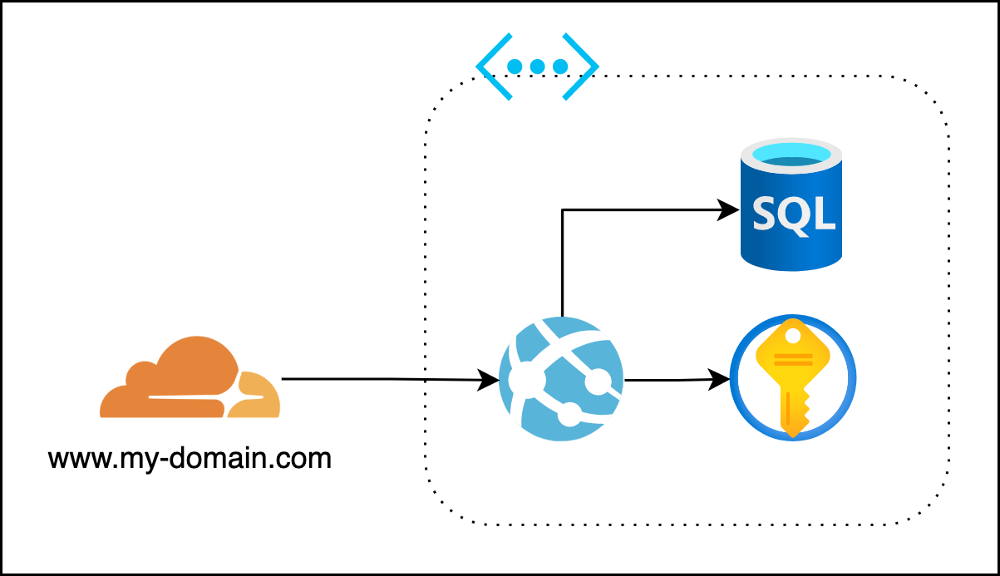

# Terraform Demo code
This repository contains the Terraform code and Azure DevOps pipeline I use the demonstrate the basics of Terraform. Want me to give this session on your meetup, conference or company? Contact me via Twitter (https://twitter.com/erwin_staal) or LinkedIn (https://www.linkedin.com/in/erwinstaal/).

## Terraform
The code in this demo deploys a few resources to Azure and Cloudflare. On Azure, it creates an App Service which can store its data in a SQL Server Database. To securely store connection details, a Key Vault is added. Cloudflare is used to create nice FQDN for the website.

### Terraform features
Terraform features demonstrated
- Use of multiple providers
- Variables
- Outputs
- Modules
- Dependencies between resources
- Configuration to manage multiple environments
- Use of Azure DevOps pipeline to deploy infrastructure
- The use of Git pre-commit hooks to validate Terraform code
- The Terraform CLI

## Slides
The slides for this session, explaining the basic concepts of Terraform can be found [here](Terraform-101-24.pdf)

## Azure DevOps Pipelines
The pipeline in this repositry uses multiple stages to deploy the infrastructure. It first runs a built in which it saves the Terraform code as an artifact for use in later stages. In next stages if deploys the infrastructure to a development and then a production environment. It uses a manual approval step in which one can review Terraforms plan which is uploaded to Azure DevOps for review.
